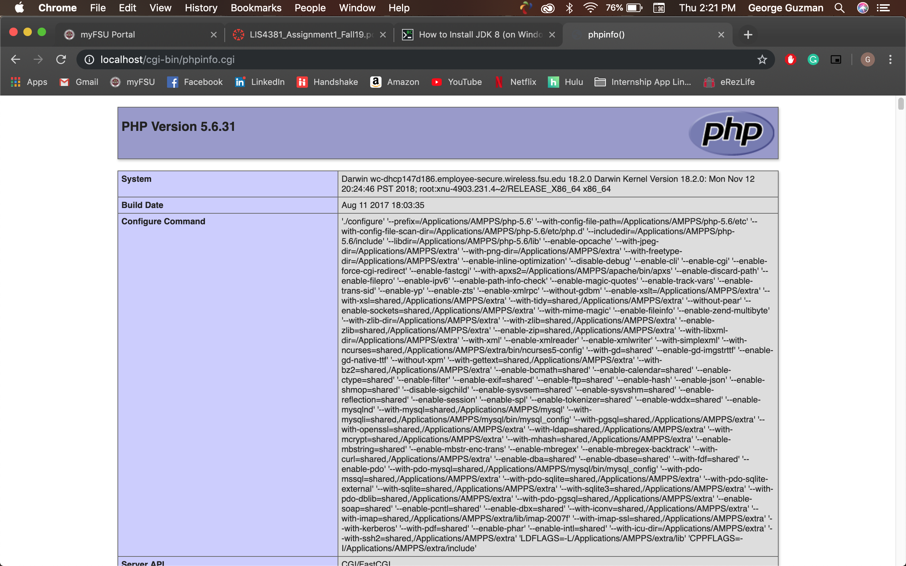
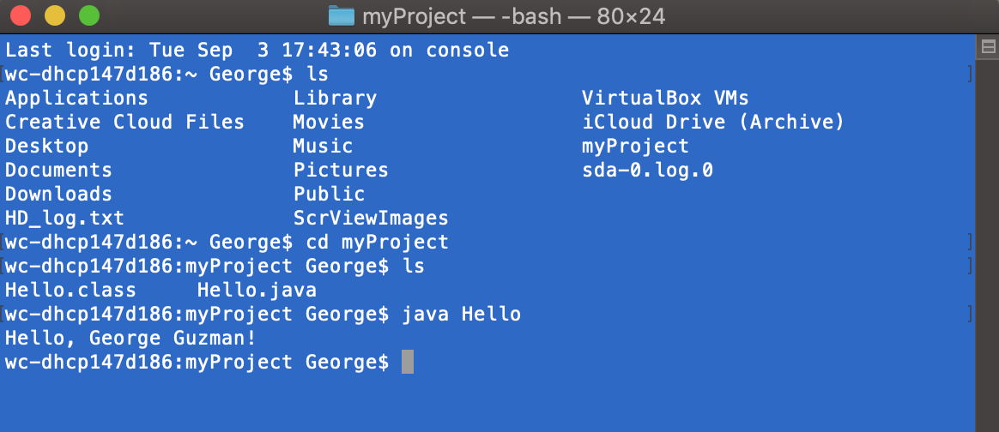
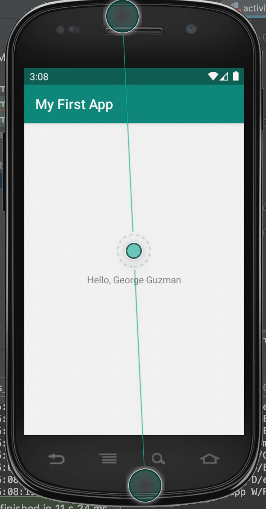

# LIS 4381 - Mobile Web App Solutions

## George Guzman

### Assignment 1 Requirements:

*Three Parts:*

1. Distributed Version Control with Git and Bitbucket
2. Development Installations
3. Chapter Questions (Chapters 1 & 2)

#### README.md file should include the following items:

* Screenshot of AMPPS Installation
* Screenshot of running java Hello
* Screenshot of running Android Studio - My First App
* Git commands with short descriptions
* Bitbucket repo links:
    * this assignment
    * completed tutorial (bitbucketstationlocations)

> This is a blockquote.
> 
> This is the second paragraph in the blockquote.
>
> #### Git commands w/short descriptions:

1. git init - Create an empty Git repository or reinitialize an existing one
2. git status - Show the working tree status
3. git add - Add file contents to the index
4. git commit - Record changes to the repository
5. git push -  Update remote refs along with associated objects
6. git pull - Fetch from and integrate with another repository or a local branch
7. git fetch - Download objects and refs from another repository

#### Assignment Screenshots:

*Screenshot of AMPPS running http://localhost*:

*Screenshot of running java Hello*:

*Screenshot of Android Studio - My First App*:

#### Tutorial Links:

*Bitbucket Tutorial - Station Locations:*
[A1 Bitbucket Station Locations Tutorial Link](https://bitbucket.org/geo2298/bitbucketstationlocations/ "Bitbucket Station Locations")

*Tutorial: Request to update a teammate's repository:*
[A1 My Team Quotes Tutorial Link](https://bitbucket.org/geo2298/myteamquotes/ "My Team Quotes Tutorial")
