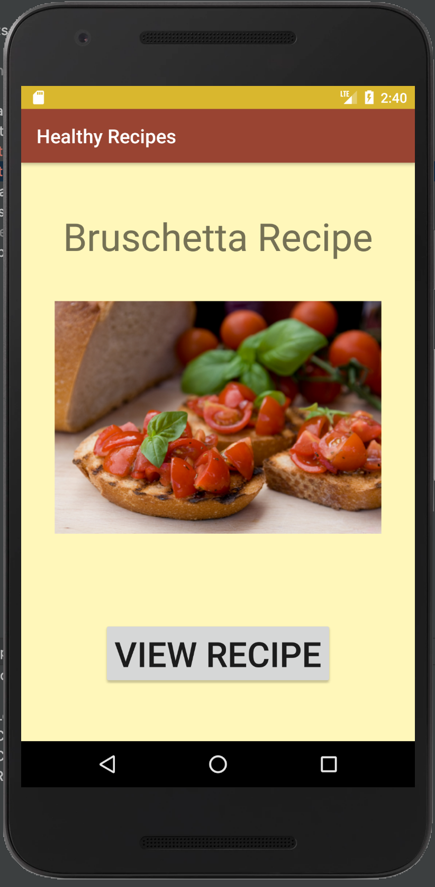
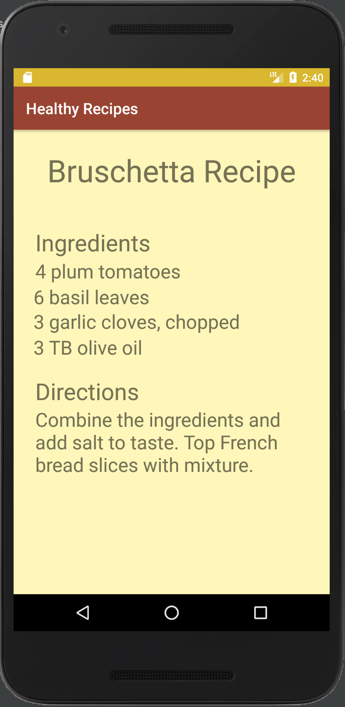

# LIS 4381 - Mobile Web App Solutions

## George Guzman

### Assignment 2 Requirements:

*Two Parts:*

1. Create a mobile recipe app using Android Studio
3. Chapter Questions (Chapters 3 & 4)

#### README.md file should include the following items:

* Screenshot of the first page of the mobile recipe app
* Screenshot of the second page of the mobile recipe app

#### Assignment Screenshots:

*Screenshot of the first screen of the application*:

*Screenshot of the second screen of the application*:

