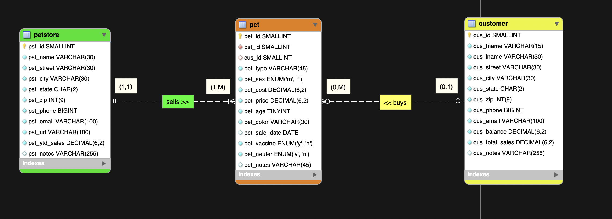
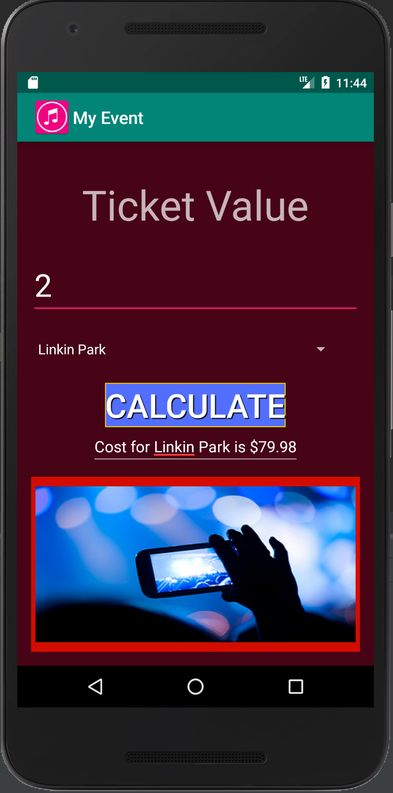

# LIS 4381 - Mobile Web App Solutions

## George Guzman

### Assignment 3 Requirements:

*Three Parts:*

1. Create an ERD using mySQL and insert 10 records
    * Forward engineer the created tables into an SQL script to ensure proper insertion of records
2. Create an application that will calculate the prices of different concert tickets
    * Utilized the XML script to place widgets rather than dragging and dropping
    * Added a launcher icon to the application
    * Changed background color
    * Added a drop shadow to the text of the button
    * Added a border to the button and the image
3. Chapter Questions (Chapter 5 & 6)

#### README.md file should include the following items:

* Screenshot of the ERD from mySQL
* Screenshot of the first activity in the My Event app
* Screenshot of the second activity in the My Event app
* Link to the .mwb file and .sql file of the mySQL assignment

#### Assignment Screenshots:

*Screenshot of the first screen of the application*:

*Screenshot of the first screen of the application*:

*Screenshot of the second screen of the application*:

#### Links to Files:

* [a3.mwb](a3.mwb)
* [a3.sql](a3.sql)

| First Screenshot  | Second Screenshot |
| ----------------- | ----------------- |
|      |       |
| Content Cell      | Content Cell      |