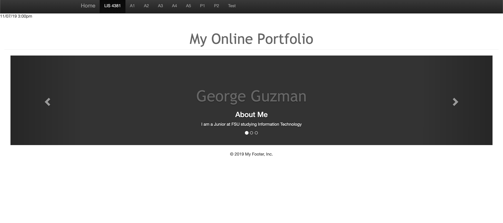
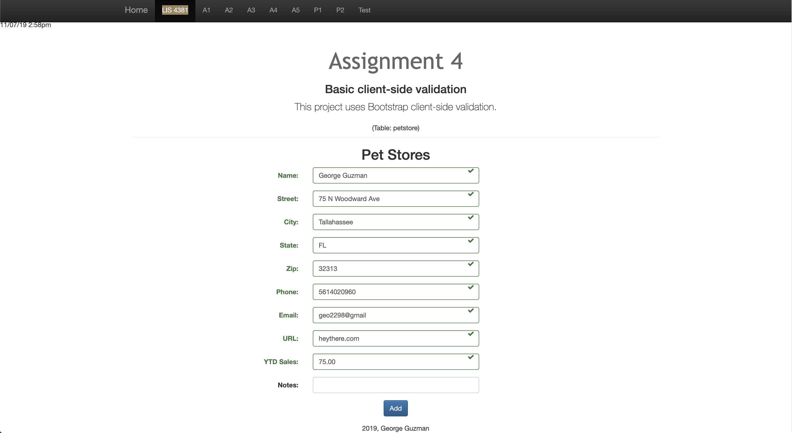
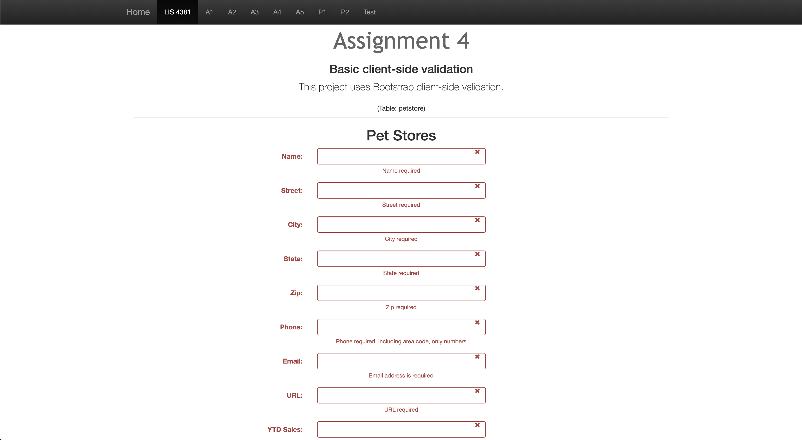

# LIS 4381 - Mobile Web App Solutions

## George Guzman

### Project 1 Requirements:

*Two Parts:*

1. Create a web application that will
    * Utilize a Bootstrap Carousel 
    * Create a form that can validate
    * Include pages to other projects
    * Utilize the local repository
2. Chapter Questions (Chapter 9, 10, & 19)

#### README.md file should include the following items:

* Screenshot of the working carousel in the home page
* Screenshot of fully validated form
* Screenshot of the form with no information in it

#### Assignment Screenshots:

*Screenshot of Carousel*:

| *Fully Validated Form* | *Not Validated Form* |
| ----------------- | ----------------- |
|      |       |

