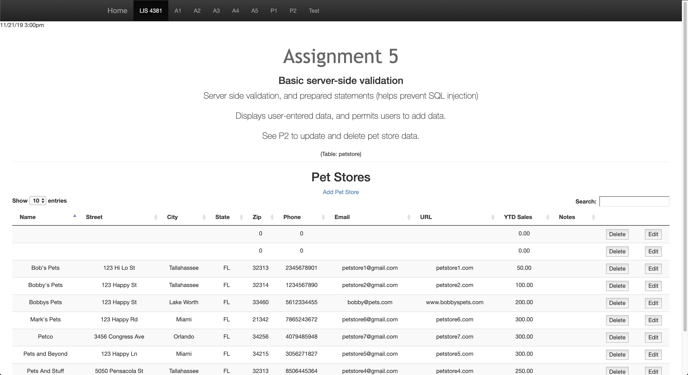
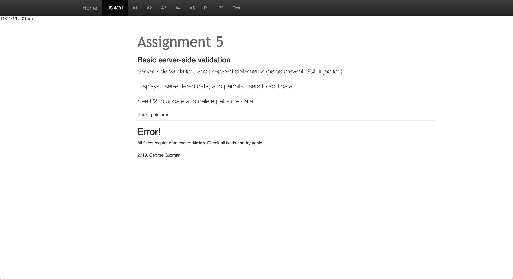

# LIS 4381 - Mobile Web App Solutions

## George Guzman

### Project 1 Requirements:

*Two Parts:*

1. Create a web application that will
    * Create a form that can validate
    * Utilize server-side validation
2. Chapter Questions (Chapter 11, 12, & 19)

#### README.md file should include the following items:

* Screenshot of the SQL feature of the website
* Screenshot of the error page

#### Assignment Screenshots:

*Screenshot of Pet Stores*:

*Screenshot of Error*:

