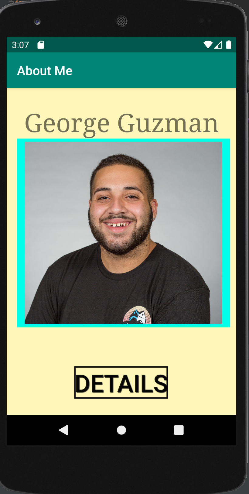
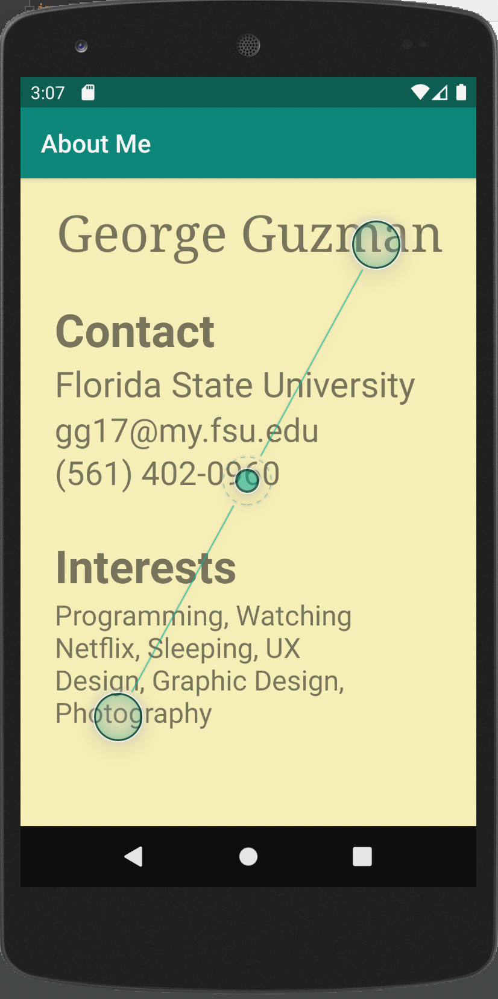

# LIS 4381 - Mobile Web App Solutions

## George Guzman

### Project 1 Requirements:

*Two Parts:*

1. Create an application that will display information about me
    * Created two activities and link them together 
    * Utilized the XML script to place widgets rather than dragging and dropping
    * Added a launcher icon to the application
    * Changed background color
    * Added a drop shadow to the text of the button
    * Added a border to the button and the image
2. Chapter Questions (Chapter 7 & 8)

#### README.md file should include the following items:

* Screenshot of the first activity in the About Me app
* Screenshot of the second activity in the About Me app

#### Assignment Screenshots:

| *First Screenshot of Activity* | *Second Screenshot of Activity* |
| ----------------- | ----------------- |
|      |       |

