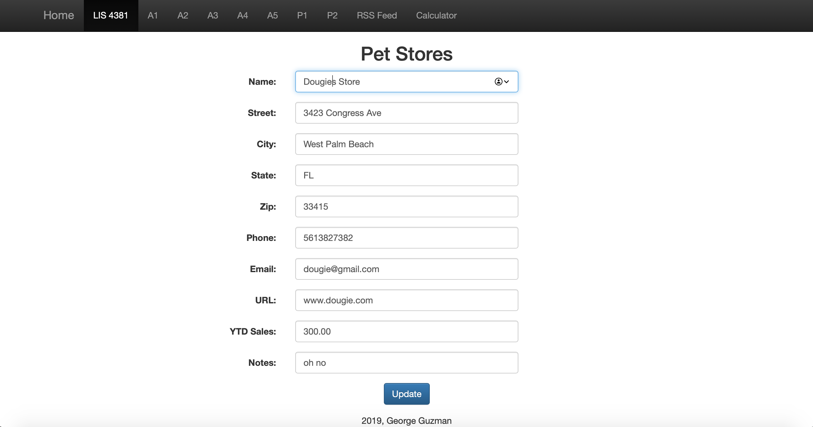
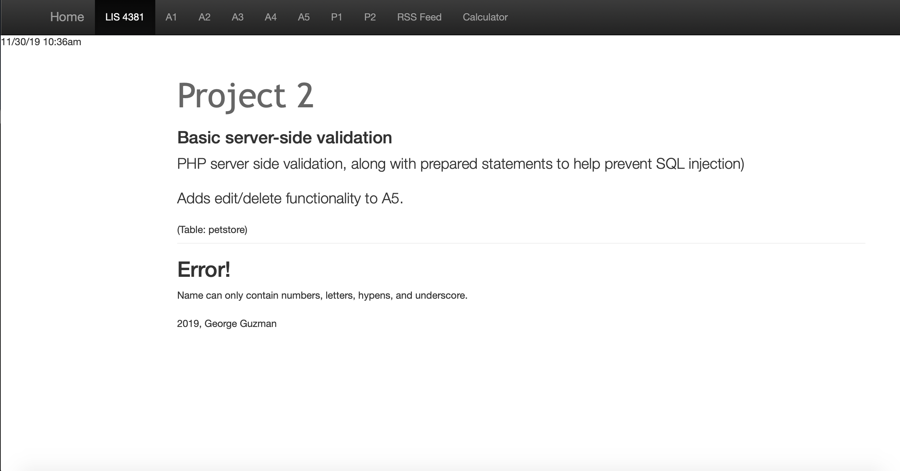
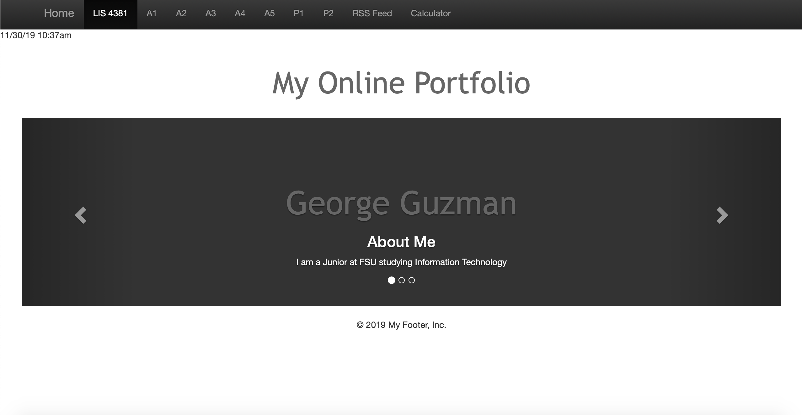
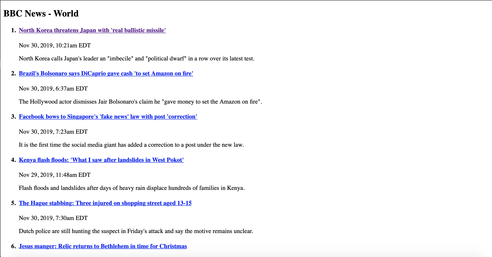

# LIS 4381 - Mobile Web App Solutions

## George Guzman

### Project 2 Requirements:

*Two Parts:*

1. Create a web application that will
    * Create a form that can validate
    * Utilize PHP server-side validation
        * Include prepared statements to prevent SQL injection
    * Adding edit/delete functionality to the Pet Store form      
2. Chapter Questions (Chapter 13 & 14)

#### README.md file should include the following items:

* Screenshot of the edit page that includes a working update button at the botton
* Screenshot of the error page that will display what field needs to be fixed
* Screenshot of the working carousel displaying information about me
* Screenshot of a working RSS that displays accurate and updated information including date and time

#### Assignment Screenshots:

*Screenshot of the form editing*:

*Screenshot of error page*:

*Screenshot of the carousel page*:

*Screenshot of the RSS page*:

